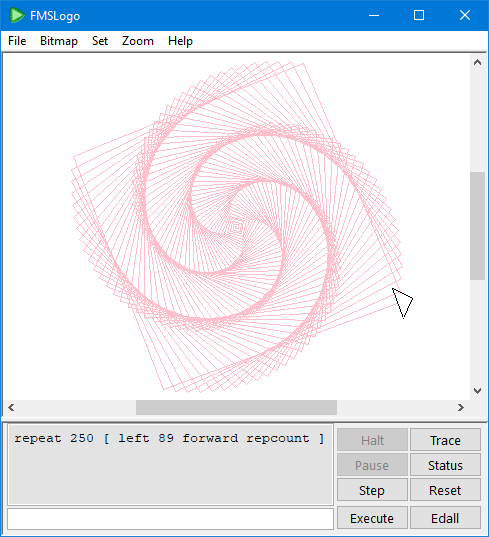

# Welcome to the world of FMSLogo!

FMSLogo is a free implementation of a computing environment called Logo, which is an interactive programming language that is simple, powerful, and best of all fun.
You can download FMSLogo from the project portal on SourceForge.

FMSLogo includes support for:

* "Standard" Logo parsing
* Turtle Graphics
* Exception handling
* TCP/IP networking
* Text in all available system fonts
* Multiple independent turtles
* Bitmapped turtles
* MIDI devices
* Direct I/O for controlling external hardware (must be admin)
* Serial and parallel port communications
* Saving and loading images in BMP format
* Calling into native DLLs
* Creating windows dialog boxes
* Event driven programming (mouse, keyboard, timer)
* Controlling multimedia devices (WAV sound files, CD-ROM control, etc.)
* 3D Perspective drawing (wire-frame and solids)
* Creating animated GIFs

# Why FMSLogo?

* FMSLogo has a simple GUI that encourages learning.
* FMSLogo provides support for exploring diverse disciplines, including mathematics, engineering, art, music, and robotics.
* FMSLogo runs fine on computers that are 10 years old.
* FMSLogo has a strong, international user community with over a decade of classroom experience.

Because of this, FMSLogo is ideal for elementary school computer labs.
